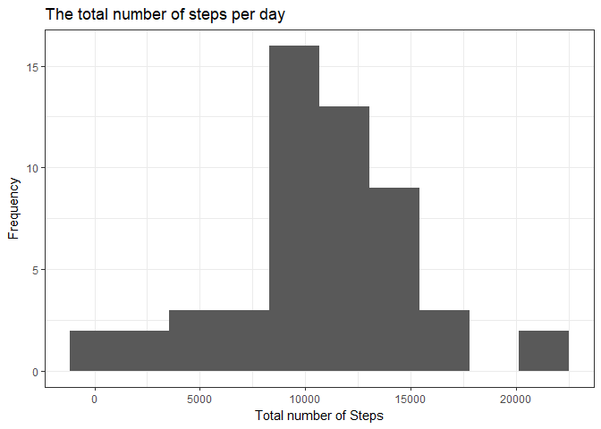
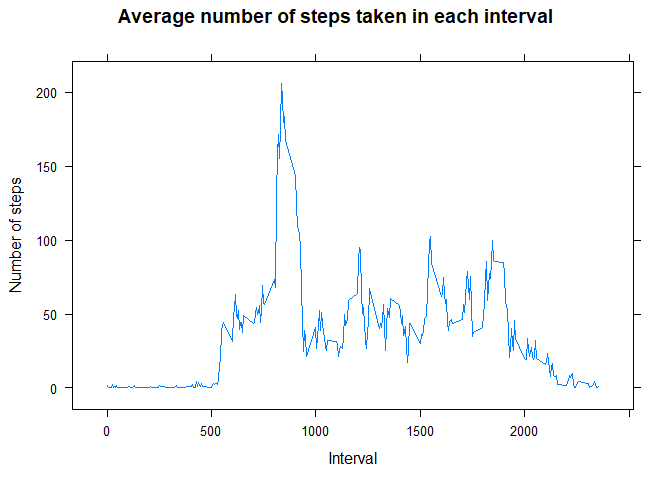
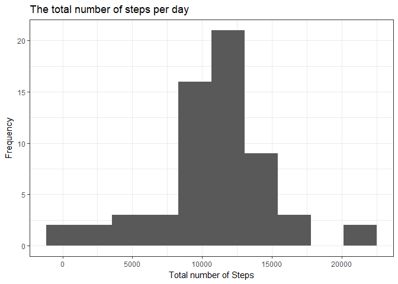
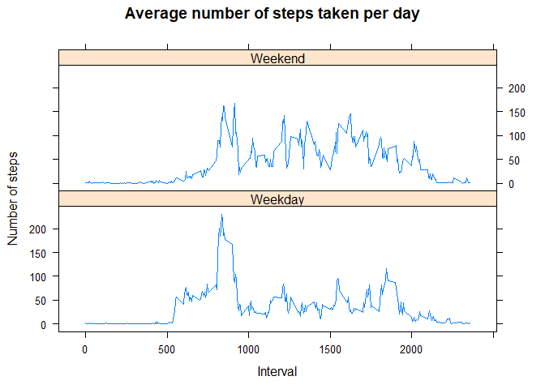

# Step analysis
Sheryl Harshberger  
July 29, 2017  

Many people today wear devices that count the number of steps that they take.  Some of this data has been made available on the internet.  This has prompted many interesting questions.  Here I analyze the data from a single person to answer some interesting questions.

# Reading in the data

This is where I unzip and read the file given in the Github repository into the working directory.  You can access the Github repository by clicking [here](https://github.com/hsheryl/RepData_PeerAssessment1). The data is already in a long format with one variable per column and one observation per row so the only preprocessing I need to do is convert the date as a factor to the date as a POSIXct.


```r
unzipped <- unzip("activity.zip")
data <- read.csv(unzipped)
data$date <- as.POSIXct(data$date)
rm(unzipped)
```

# Total number of steps  

It might be interesting to find out just how many steps this person takes each day.  This section calculates the total number of steps taken each day, and the interquartile range, then stores to values for later use.


```r
library(dplyr)
library(ggplot2)
library(stats)
library(lattice)
library(graphics)

summary <- data %>%
     filter(!is.na(steps)) %>%
     group_by(date) %>%
     summarise(number = sum(steps))

interquartile <- IQR(summary$number)
numberobs <- summarise(summary, number = n())
n <- numberobs[[1]]
options(scipen = 7, digits = 2)
rm(numberobs)
```

#Graphing the total  

To visualize the total number of steps taken in a day a histogram will work nicely.  After trying several methods of calculating the bin width I decided to use the Freedman-Diaconis rule.  More information on this method of choosing a bin width, along with a wonderful discussion of different methods of finding the number of bins or bin widths, can be found at [Wikipedia](https://en.wikipedia.org/wiki/Histogram#Number_of_bins_and_width) 


```r
fdwidth <- 2*interquartile/((n)^(1/3))

ggplot(summary, aes(number)) +
     geom_histogram(binwidth = fdwidth) +
     labs(x = "Total number of Steps", y = "Frequency", 
          title = "The total number of steps per day") +
     theme_bw()
```

<!-- -->

It might be interesting to find out what the mean and median are for steps per day so here they are calculated.


```r
stepmean <- mean(summary$number)
stepmed <- median(summary$number)
rm(summary, interquartile, n)
```

The mean is 10766.19 and the median is 10765.  

#Average daily activity pattern  

Next lets find out which times this person is most active and which times he or she is not as active.  Here I summarize the number of steps by the time of the day and then find the average for each five minute interval.  Below is a plot of the average number of steps taken in each five minute interval during the day.


```r
summary <- data %>%
     filter(!is.na(steps)) %>%
     group_by(date, interval) %>%
     summarise(number = sum(steps))
     

summary2 <- summary %>%
     group_by(interval) %>%
     summarise(avg = mean(number))


xyplot(avg ~ interval, data = summary2, type = "l", 
       xlab = "Interval",
       ylab = "Number of steps", 
       main = "Average number of steps taken in each interval")
```

<!-- -->


From the graph above there is a definite peak in the morning. We might be interested in exactly what five minute interval is that peak. Here I look for the five minute interval with the maximum number of steps.


```r
activitymax <- summary2[which(summary2$avg == max(summary2$avg)),]
maxinterval <- activitymax$interval
rm(summary, summary2)
```

The interval with maximum number of steps is 835.  

#Dealing with missing values  

Something that can affect an analysis is the nature of missing values.  First off, it would be nice to know how many missing values there are.  Here I calculate the number of missing values for the three variables inside the data frame.


```r
stepsmiss <- sum(is.na(data$steps))
datemiss <- sum(is.na(data$date))
intervalmiss <- sum(is.na(data$interval))
```

So there are 2304 missing values for the steps variable, 0 missing values for the date variable, and 0 missing values for the interval variable.  

It is nice to know that there are no missing values in either the date or the interval variables.  But that leaves the steps variable to deal with.  

Simply removing the missing values would make whole days disappear from the data set and would not be representative since it is likely that some steps were taken on those days.  There are other methods of dealing with the missing values but in this case I am choosing to replace the missing values by finding the average for each five minute interval and then replacing the missing value with the corresponding average.  I feel that this method of replacement allows me to preserve more of the structure of the data set then other methods might.


```r
replacevalues <- data %>%
     filter(!is.na(steps)) %>%
     group_by(interval) %>%
     summarise(avg = mean(steps))

nonmissing <- select(data, date, interval, steps)

nonmissing$steps[is.na(nonmissing$steps)] <- replacevalues$avg[match(nonmissing$interval,replacevalues$interval)][which(is.na(nonmissing$steps))]
rm(replacevalues, activitymax, datemiss, intervalmiss, stepsmiss, maxinterval)
```

#How did things change?

It would be very interesting to see how filling in the missing values with the interval averages might have changed the data set.  First, lets recreate the histogram of total steps per day.  I am using the same bin width as I did above so the histograms can be compared.


```r
summary <- nonmissing %>%
     group_by(date) %>%
     summarise(number = sum(steps), mean = mean(steps), med = median(steps))

ggplot(summary, aes(number)) +
     geom_histogram(binwidth = fdwidth) +
     labs(x = "Total number of Steps", 
          y = "Frequency", 
          title = "The total number of steps per day") +
     theme_bw()
```

<!-- -->

We can see that there have been changes.  Both middle bins have more values in them, reflecting the use of averages to fill in for the missing data.  

Next we could see if the mean or median have shifted.


```r
stepmean2 <- mean(summary$number)
stepmed2 <- median(summary$number)
rm(summary, fdwidth)
```

The mean is 10766.19 and the median is 10766.19. 

We can see that this method of filling in the missing values has not significantly altered the mean number of steps or the median number of steps.  

#Weekdays vs. weekends

Another interesting questing that we can ask is whether the activity pattern for the weekend days is different from the activity pattern for the weekdays for this person.  


```r
summary <- nonmissing %>%
     group_by(date, interval) %>%
     summarise(number = sum(steps))
     

summary$day <- weekdays(summary$date)

summary$day <- gsub("Saturday|Sunday", "Weekend", summary$day)
summary$day <- gsub("Monday|Tuesday|Wednesday|Thursday|Friday", "Weekday", summary$day)

summary2 <- summary %>%
     group_by(day, interval) %>%
     summarise(avg = mean(number))


xyplot(avg ~ interval | day, data = summary2, type = "l", layout = c(1,2), 
       xlab = "Interval",
       ylab = "Number of steps", 
       main = "Average number of steps taken per day")
```

<!-- -->

We can see from this chart that this person is more active throughout the day on the weekends as compared to weekdays when activity seems to drop off some after a single large spike around 8:30am.  

# Conclusion

The counting step craze has generated lots of data, and its continuing popularity will ensure that even more is generated in the coming years. Those who are interested in participating in counting steps could easily ask questions about their average number of steps taken per day and their pattern of activity throughout the day. This analysis has practical application in providing the answers for those questions.  
<br>
<br>


